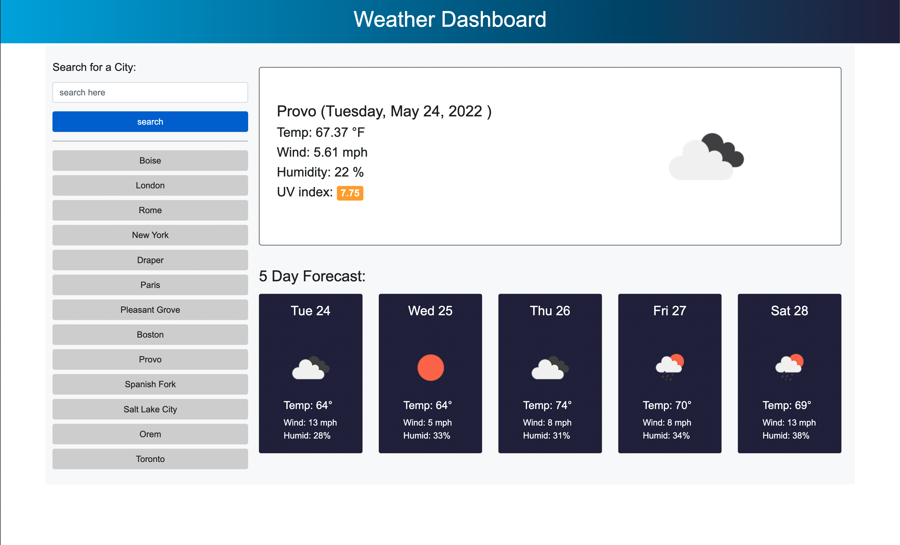

# Weather Dashboard

## Click here to see the live deployed app: https://nadybee.github.io/Weather_Dashboard/

### Module 6 challenge assignment for boot camp.

Users can search by city to find the current weather and the 5 day forecast.

- The weather data is being fetched from https://openweathermap.org/api

- bootstrap framework for styling

- day.js for date formatting

